# Dev Enviroment Setup

The excel-importer is an Eclipse RCP extension, contributing to the Axon Ivy Designer featureset. This guide explains the steps to setup the development environment for it.

It was written for LTS10 and EclipseRCP 2024-03.

### Eclipse RCP

To start with, we need an Eclipse IDE for development.

1. Download the latest EclipseRCP IDE from the official site. 
2. Unpack the ZIP to a location of your choice
3. Run the Eclipse binary in it; and pick a yet empty workspace for development

### Target Platform

Here's how you can setup your eclipseRCP to build upon the AxonIvyDesigner platform.

1. Navigate to "Window" > "Preferences" > "Plug-in Development" > "Target Platform"  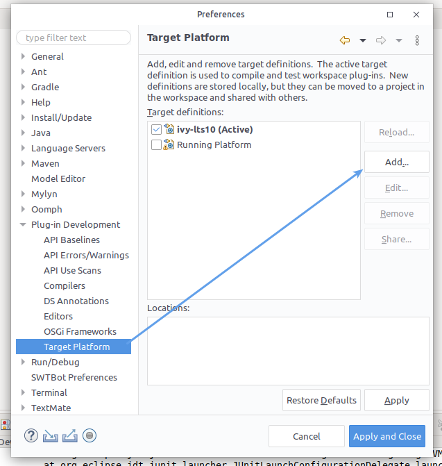

2. Click on the "Add" button to setup the Designer platform

3. In the wizard, choose "Nothing: start with an empty definition" and click"Next"

4. Click "Add" to create a new Target

5. Choose "Software Site" and click "Next"
   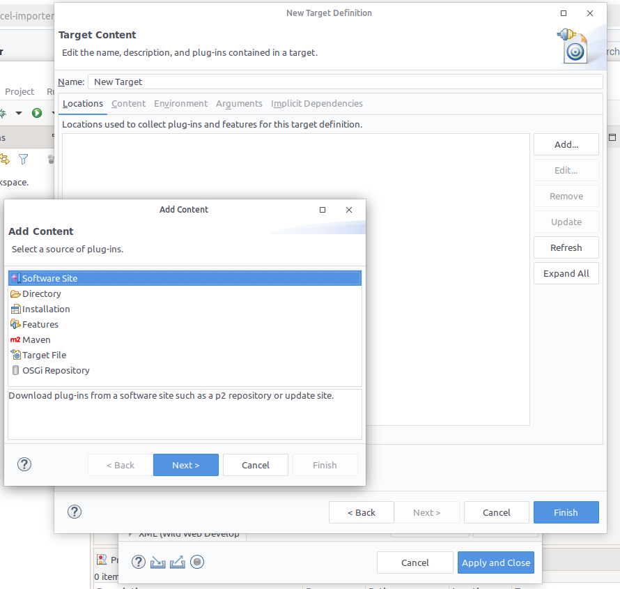

6. On top in the "Work with section" click on "Add..."
   
   1. name = lts10
   2. location = https://p2.axonivy.com/p2/10.0/
   3. hit the 'add' Button to close the modal dialog
      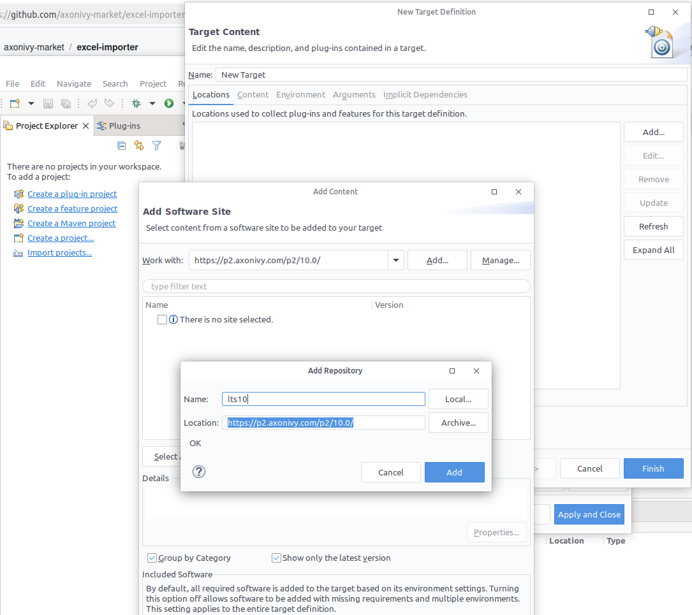

7. Check all features and categories to be imported and proceed
   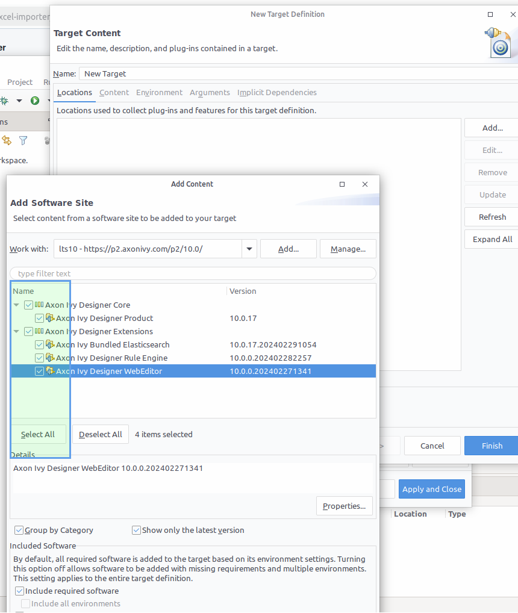

8. The platform is being download; be patient :)

9. Finally; give the 'target' a name: e.g. "ivy-lts10" and press Finish
   
   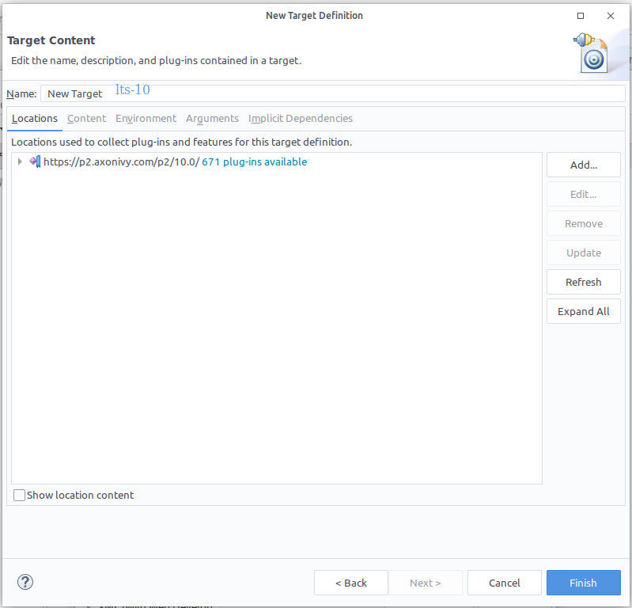

10. Back in the preferences check the newly added target "ivy-lts10" and click "apply and close"

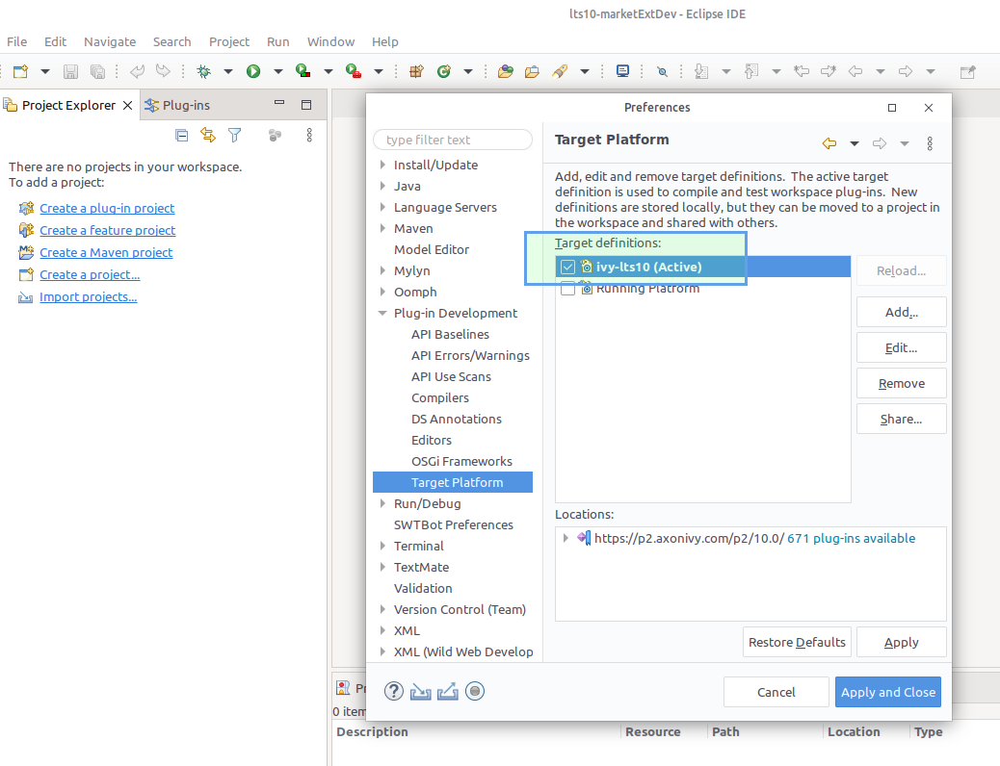

### Workspace

Now you are ready to import the "excel-importer" extension

1. Click on the Menu "File" -> "Import" -> "General" > Existing projects into workspace"
2. Select the "excel-importer" project within your local clone of this repo.
3. The extension should compile successfully.

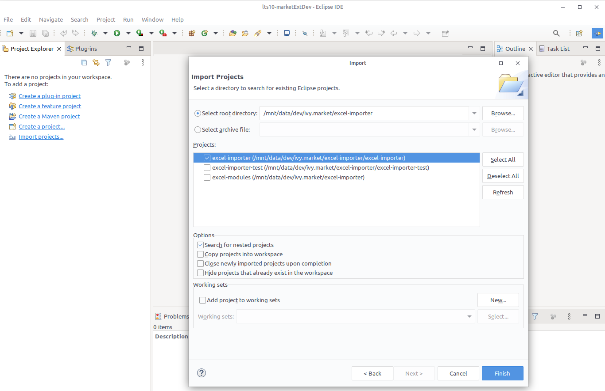

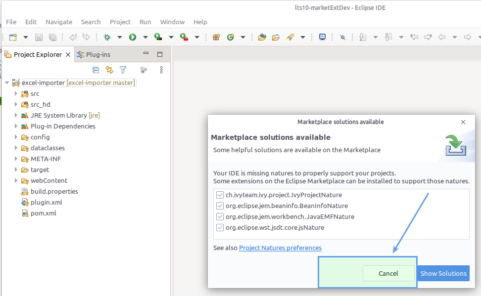

### Launch Config

Now we are building a launcher to start the Designer from the Dev environment.

1. Click on the Menu "Run" > "Run Configurations ..."
2. Right click on "Eclipse Application" and opt for "New Configuration"
3. Give the Configuration a name e.g. "DevDesigner"
4. In the Main tab, select the product to run to be "ch.ivyteam.ivy.designer.branding.product" 
5. In the Arguments tab, in the Working Directory section, choose "Other" and pass a file path to an official AxonIvyDesigner, matching your development train.
6. Hit the "Run" button ... and the Designer should start

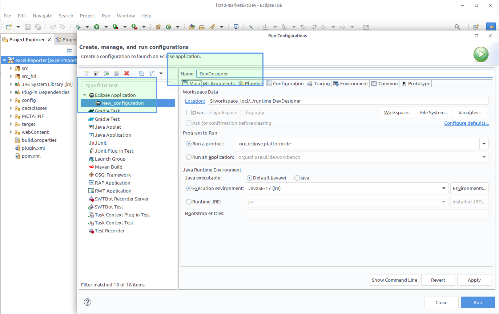

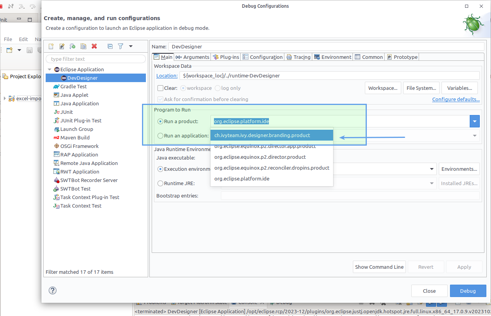

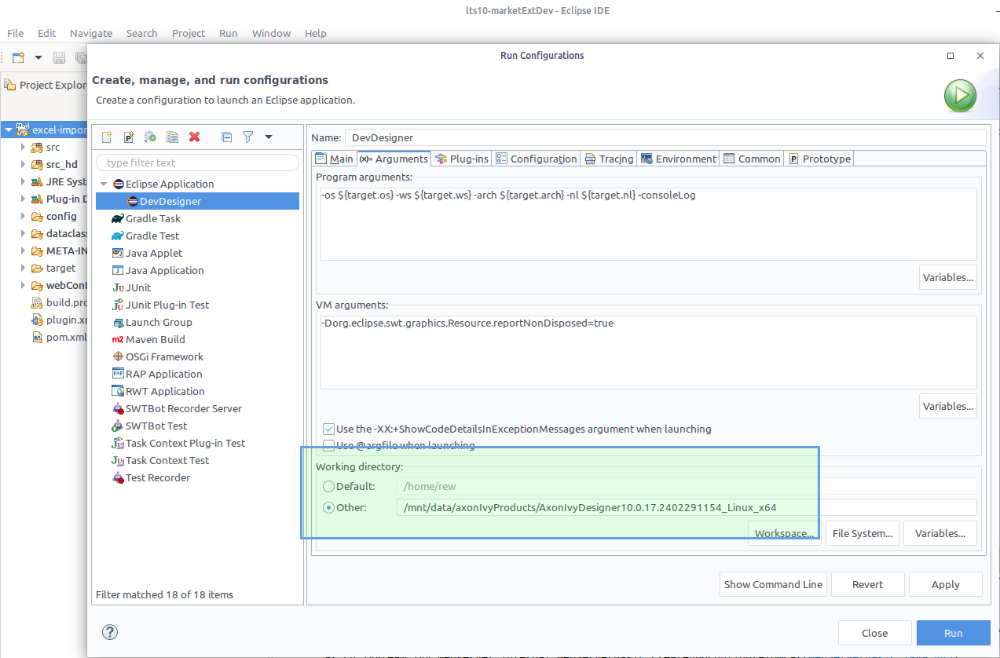

### Designer

In the Dev-Designer you can access the extension.

1. Create an empty playground Project as your "target" for demo imports.
2. Run the extension via Menu "File" -> "Import". If you run it, you will execute the code in your Eclipse RCP environment.

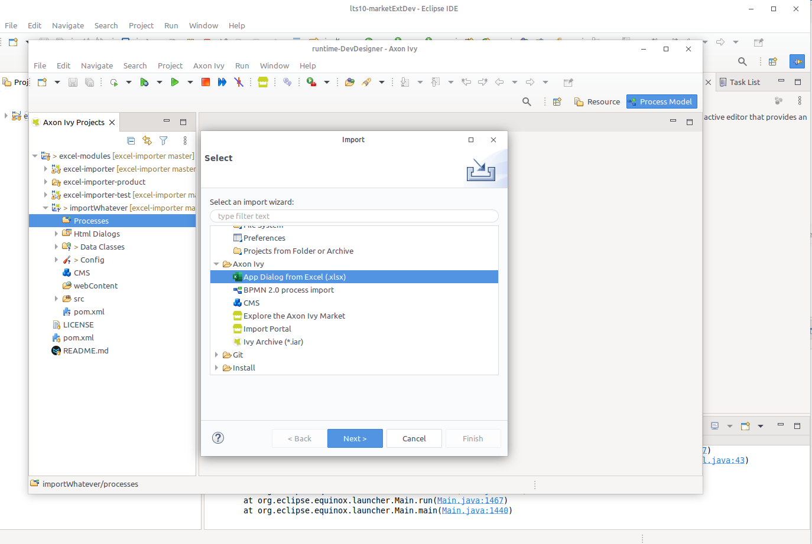

 

### Debugging

You can also debug through the extension code; though most of the code life in the consumed Ivy Platform.

1. Close any running DevDesigner instances
2. Click on the "Debug" (bug icon) in the Eclipse RCP main toolbar
3. Select the "DevDesigner" launch config
4. Add debug breakpoints into the "excel-importer" extension code
5. Trigger the import in the DevDesigner, and the execution will halt on breakpoints.

### Testing

The most important transformations when importing Excel sheets to Dialogs are tested with classical @IvyTest cases. Here's how to use them:

1. Import all projects of your local 'excel-importer' clone into the Designer workspace (yes, also the extension itself)
   1. you'll probably see two false-positive compile errors; just delete them in the Problem section.
2. Go into the Test project and select a Unit Test of your choice
3. Right click and Run it to verify your code.

These tests are of course also executed in the actions build pipeline, using Maven.

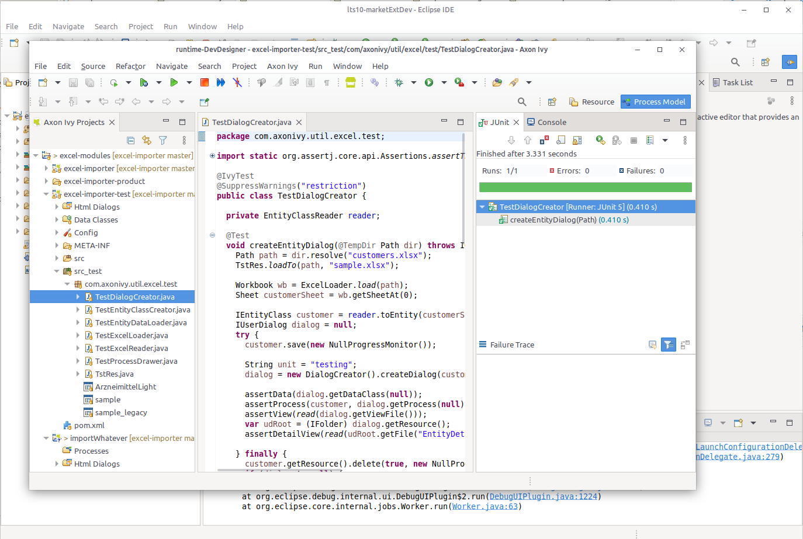
