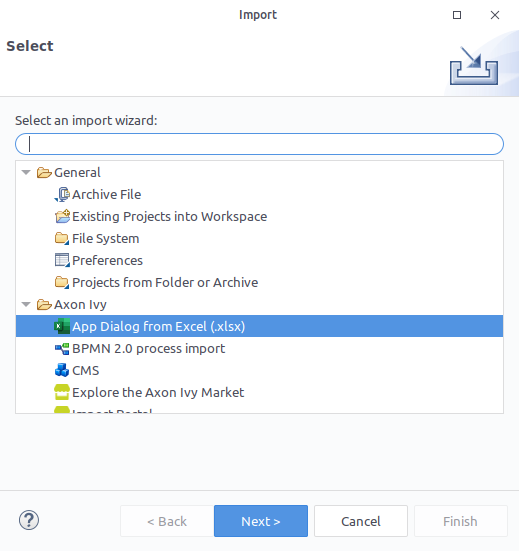
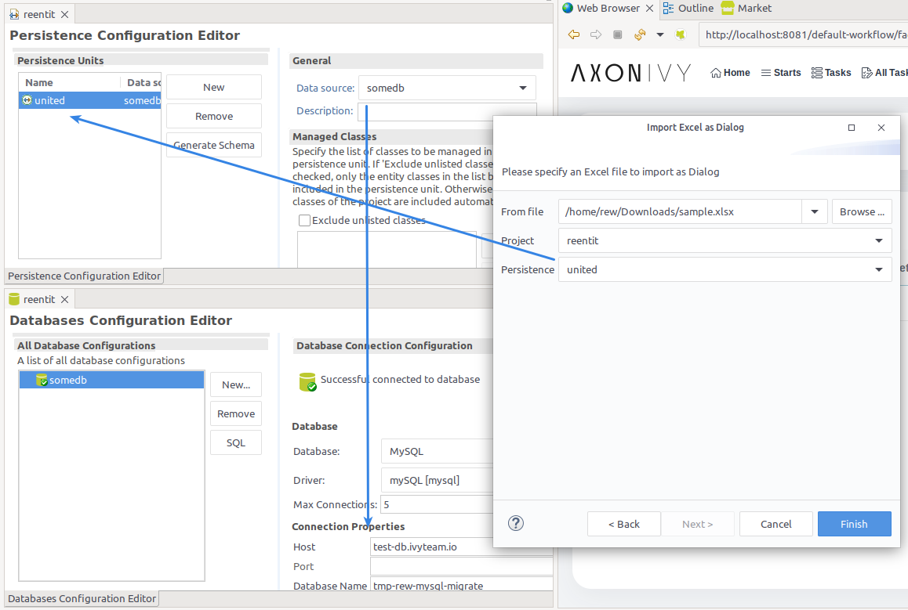
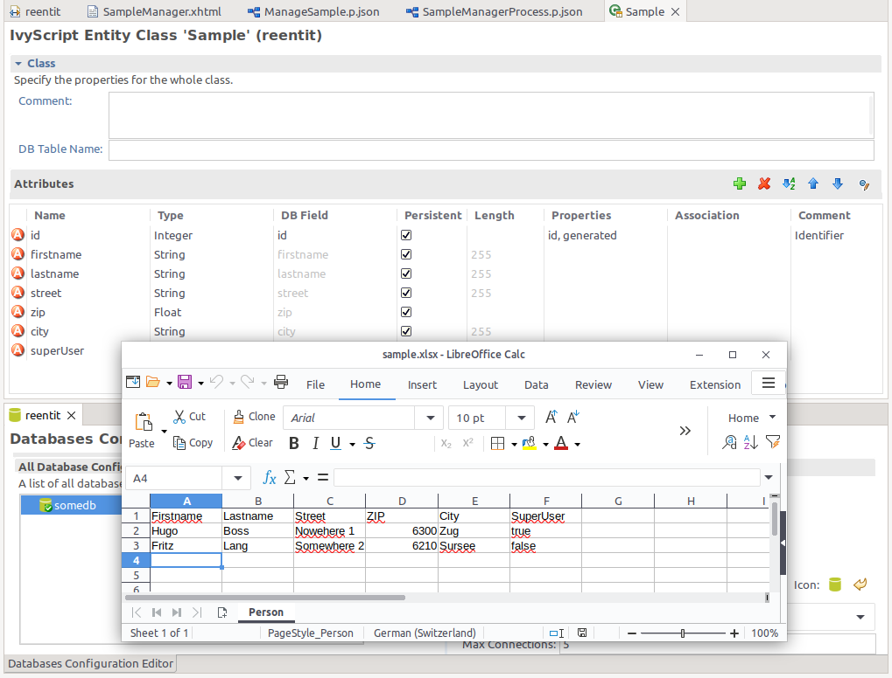
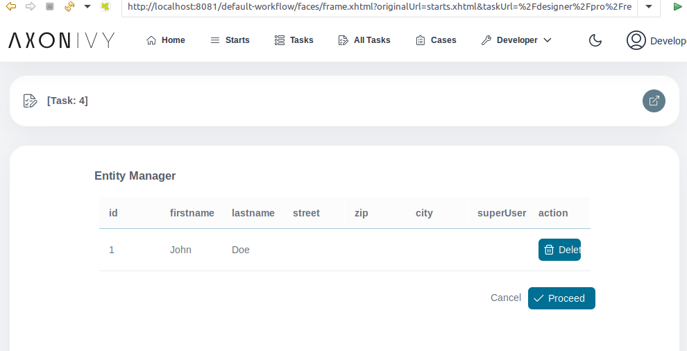

# Excel importer

Imports Excel sheets and transforms it into a full featured web application.

## Demo

1. Initiate the Excel imported via menu `File` > `Import` > `Axon Ivy` > `App Dialog from Excel`.

2. Pick a project, where the Excel records should imported to as Entity with a Dialog.

3. The importer will create the EntityClass, that represents entries in the Database.

4. A simple process will be creatd, leading to a Dialog to explore your imported Entities.

## Setup

In the project, where the Excel data should be managed:

1. Create a persistence unit under `/config/persistence.xml`
2. Add the property, to allow schema changes `hibernate.hbm2ddl.auto=create`
3. Set the Data source to a valid database. If there is none, set it up under `/config/databases.yaml`