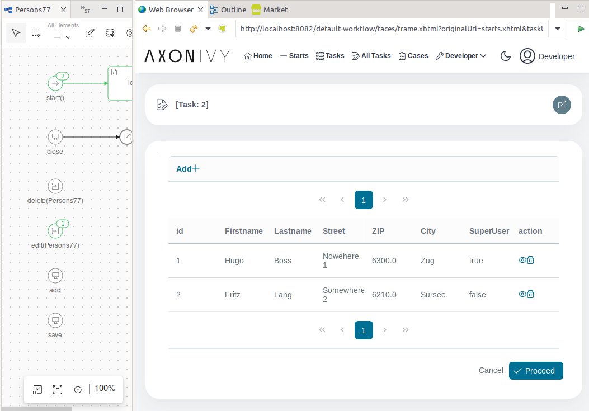
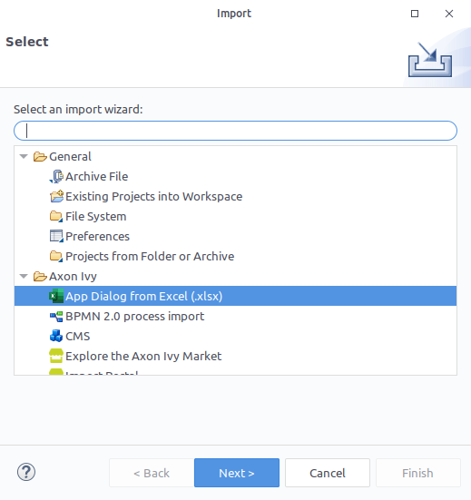
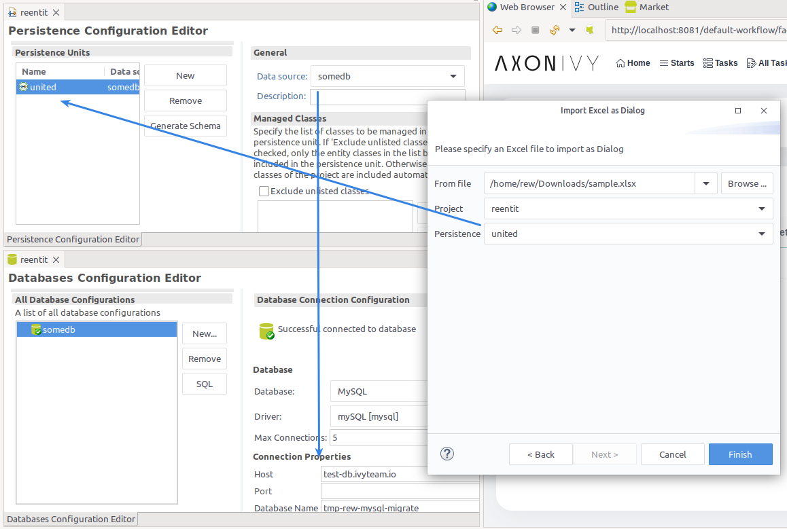
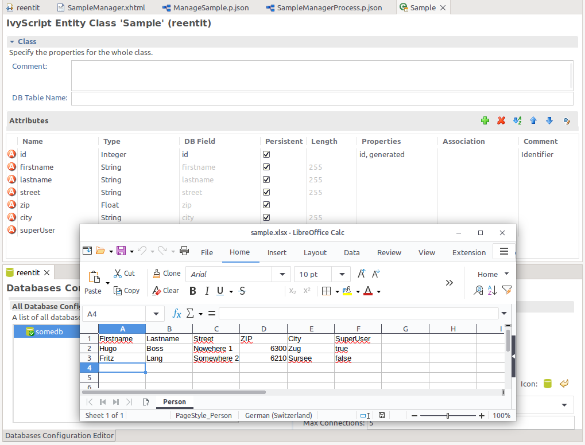
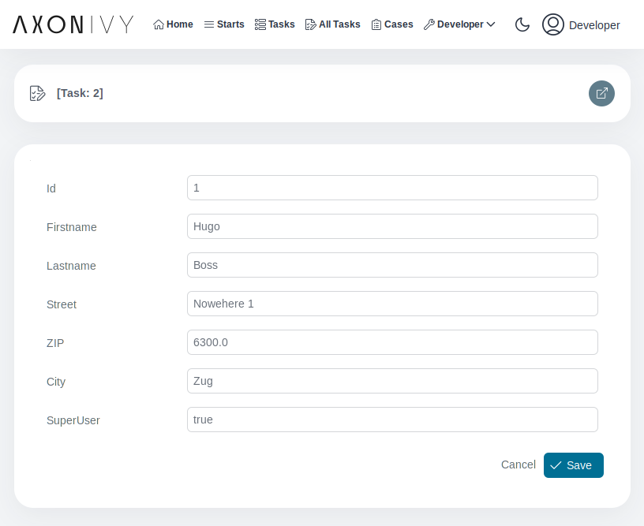

# Excel importer

This tool supports you in importing MS Excel tables into your Axon Ivy project.
The imported table is added as an entity to a project UI, where it is not only displayed but also made editable.

### Key features

- Import Excel spreadsheets and turn rows into editable entities in your Axon Ivy app.
- Automatically generates entity classes and a ready-to-use dialog UI.
- One-click wizard: choose a project and import — the importer creates the entity, process, and dialog for you.
- Built-in UI to view, add, edit, and delete records created from Excel.
- Keeps your database schema in sync with automatic schema updates.
- Compatible with common databases: MariaDB, PostgreSQL, MySQL, and MSSQL.

## Demo

1. Initiate the Excel imported via menu `File` > `Import` > `Axon Ivy` > `App Dialog from Excel`.

2. Pick a project, where the Excel records should be imported to as Entity with a Dialog.

3. The importer will create the EntityClass, that represents entries in the Database.

4. A simple process will be created, leading to a Dialog to explore your imported Entities.

5. Furthermore, the Dialog allows you to modify, delete and add new entries.

## Setup

In the project, where the Excel data should be managed:

1. Create a persistence unit under `/config/persistence.xml`
2. Add the properties
  - `hibernate.hbm2ddl.auto=update` (to allow schema changes)
3. Set the Data source to a valid database. If there is none, set it up under `/config/databases.yaml`

## Compatibility

This connector has been successfully tested with the following DBMS:

- **MariaDB** (MariaDB 11.7.2-MariaDB)
- **PostgreSQL** (PostgreSQL 17.4)
- **MySQL** (MySQL Server 9.1.0)
- **MSSQL** (Microsoft SQL Server 2022)

You may try it with other products and file us an [issue](https://github.com/axonivy-market/excel-importer/issues) if something doesn't work.

## Components

- Dialogs & processes (main module: `excel-importer`):
  - `EntityManager.xhtml` — UI to browse and manage imported entities.
  - `EntityDetail.xhtml` — Dialog for viewing and editing a single entity.
  - `EntityManagerProcess.p.json` — Dialog process exposing: `start()`, `delete(MyEntity)`, `edit(MyEntity)`, `save`, `add`.
