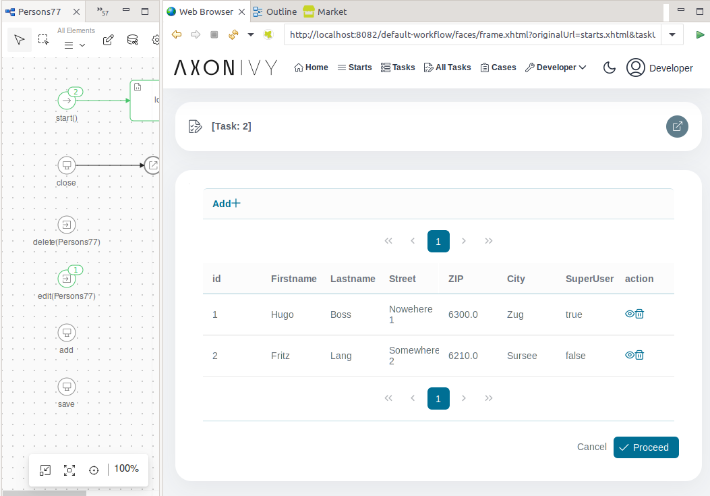

# Excel Importer

Dieses Tool unterstützt dich beim Importieren von MS Excel-Tabellen in dein Axon Ivy-Projekt.
Die importierte Tabelle wird als Entität zu einer Projektoberfläche hinzugefügt, wo sie nicht nur dargestellt wird, sondern auch editierbar ist.

