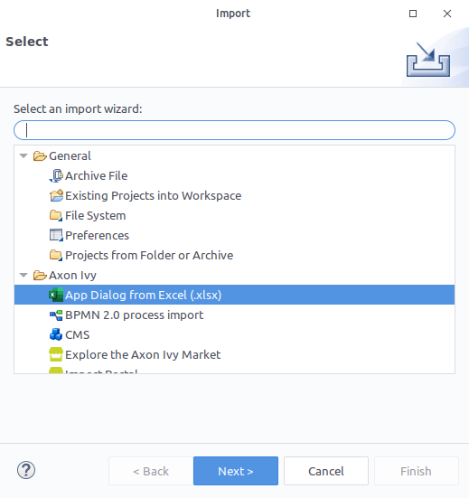
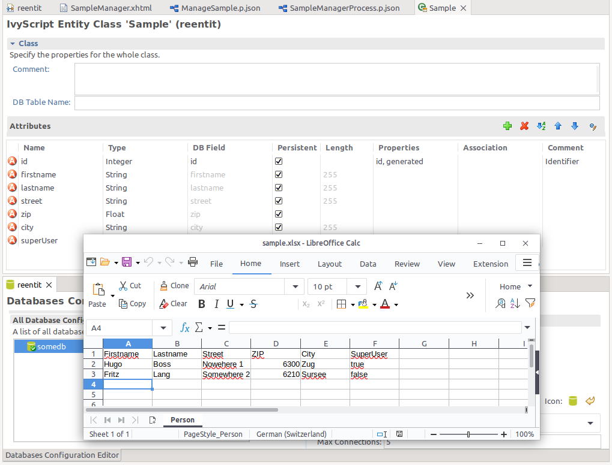

# #Exzellieren Importeur

Dieses Tool unterstützt du in #einführend FRAU #Exzellieren Tische hinein euren
#Axon Efeu projiziert. Der #eingeführt Tisch ist #zufügen da eine Entität zu
einem Projekt UI, #wo ist es nicht nur gezeigt aber auch gemacht #editierbar.

## Demo

1. Lauf an das #Exzellieren importiert via Speisekarte `Datei` > `Einfuhr` >
   `#Axon Efeu` > `#App Zwiegespräch von #Exzellieren`.
   

2. Pflück ein Projekt, #wo das #Exzellieren Schallplatten sollten sein
   importiert zu wie Entität mit einem Zwiegespräch.
   

3. Der Importeur will schaffen der EntityClass, jener vertritt Einträge in der
   Datenbank. 

4. Ein simpler Arbeitsgang will sein geschafft, zeitigend ein Zwiegespräch zu
   erkunden eure #eingeführt Entitäten.
   

5. Ferner, das Zwiegespräch erlaubt du zu modifizieren, streich und füg zu neue
   Einträge. 

## Einrichtung

In dem Projekt, #wo dem #Exzellieren #Daten sollte sein fertiggebracht:

1. Schaff unter eine Beharrlichkeit Einheit `/config/Beharrlichkeit.xml`
2. Füg zu die #Besitz
  - `Überwintern.hbm2ddl.#Auto=Update` (zu erlauben Schema Änderungen)
3. Setz die #Daten Quelle zu einer gültigen Datenbank. Ob dort ist #nichts, setz
   ihm hin unter `/config/Datenbanken.yaml`

## Kompatibilität

Dieser Anschluss hat gewesen erfolgreich getestet mit das folgendes DBMS:

- **MariaDB** (MariaDB 11.7.2-MariaDB)
- **PostgreSQL** (PostgreSQL 17.4)
- **MySQL** (MySQL Server 9.1.0)
- **MSSQL** (#Microsoft SQL Server 2022)

Du darfst probieren es mit anderen Produkten und feilen uns #ein [gebt
heraus](https://github.com/axonivy-market/excel-importer/issues) ob #irgendetwas
arbeitet nicht.
